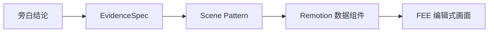

# Football Editorial Video Engine

## 设计讨论完整记录

- **整理时间**：2026-09-25
- **文档状态**：Scene Library v0.1 已定义；Motion Language v0.1 为下一阶段
- **内部视觉系统名称**：Football Editorial Explainer（简称 **FEE**）
- **产品定义**：Football Editorial Video Engine

> 本文合并记录此前围绕足球赛前前瞻视频系统的全部讨论。它是设计系统和实施依据，不是最终的 `SKILL.md`。

---

## 1. 项目方向的变化

最初的目标可以描述为：

> 做一个生成 Vox 风格足球前瞻的 Skill。

经过对参考视频的分析，产品定义调整为：

> **做一个 Football Editorial Video Engine，然后用 Skill 调度它。**

系统中的角色分工如下：

- **Skill**：导演，负责理解旁白、选择叙事结构和 Scene Pattern，并调度素材与动效。
- **Remotion**：摄影棚，负责确定性的排版、数据、战术图形和动画渲染。
- **ChatGPT Images 2.5**：插画师，负责环境氛围和主体人物素材。
- **足球数据**：研究员，负责事实、统计、赛程、阵型和历史数据。
- **Scene Patterns + Motion Presets + Visual Grammar**：品牌本身。

目标不是每次随机生成一张“像 Vox 的图片”，而是建立一套可重复调用的视觉和叙事系统。

---

## 2. 参考视频与提炼出的共性

本轮分析使用了三条参考视频：

1. `0基础看足球 [8]｜足球俱乐部是什么？俱乐部里只有球员吗？`
2. `0基础看足球 [11]｜巴萨 vs 皇马，为什么被称为国家德比？`
3. `0基础看足球 [2]｜C罗为什么被称为越位王？理解为什么要有越位，就懂了越位`

它们共同呈现出一种可抽象为 **Football Editorial Explainer** 的视觉语言：

- 纸张、米白、低饱和纹理作为基底
- editorial collage（编辑式拼贴）
- cutout / illustration 主体
- heavy sans / condensed headline
- 中性色加 1～2 个高饱和强调色
- 强不对称构图
- 一屏只承担一个主要观点
- 快速 reveal，稳定 hold
- graphic wipe 优先于 dissolve
- 少用传统摄影机移动
- 使用箭头、圆圈、标签解释信息
- 球场、地图、统计图承担“第二舞台”功能
- 画面通过不断加入或重置视觉信息来配合旁白节奏

参考视频的核心不是“动效很多”，而是：

> **graphic design that moves**

它追求会运动的平面设计，而不是把一堆 moving effects 叠在画面上。

---

## 3. Visual Grammar v0.1

### 3.1 基础风格规则

| 维度 | 规则 |
|---|---|
| 基底 | 米白、纸张、低饱和纹理 |
| 视觉语言 | Editorial collage |
| 主体 | Cutout / illustration |
| 字体 | Heavy sans / condensed headline |
| 颜色 | 中性色 + 1～2 个高饱和强调色 |
| 构图 | 强不对称 |
| 信息 | 一屏一个主要观点 |
| 动效 | 快速 reveal，稳定 hold |
| 转场 | Graphic wipe 优先于 dissolve |
| 镜头 | 少用传统 camera movement |
| 解释 | Arrows / circles / labels |
| 足球专用 | Tactical pitch / map / stats |
| 节奏 | 视觉不断增加或重置 |

### 3.2 四层结构

每个 Scene 使用统一的四层结构：

```text
L0 Environment   环境层
L1 Subject       主体层
L2 Information   信息层
L3 Annotation    解释标注层
```

职责划分：

- **L0 Environment**：球场、城市、纸张、历史氛围、色块和纹理。
- **L1 Subject**：球员、教练、球队主体、球场主体或其他 cutout。
- **L2 Information**：标题、球队名、数字、日期、统计、结论和主要文字。
- **L3 Annotation**：箭头、圆圈、连线、区域、地图定位点、标签和强调标记。

### 3.3 生成与程序化的硬规则

ChatGPT Images 2.5 只负责：

```text
Environment
Subject
```

Remotion 负责：

```text
Typography
Data
Maps
Pitch
Lines
Arrows
Circles
Labels
Motion
```

因此：

- 不让图片模型生成球队名、比分、统计数字、日期或标签。
- 不让图片模型生成需要准确识别的队徽。
- 事实、文字、数据、地图、战术、箭头和标注全部程序化。
- 不为了使用图像生成而使用图像生成。
- 不再把“背景图、中景图、前景图”全部交给生成模型。
- 推荐的资产目录是：

```text
assets/
    environments/
    subjects/

scenes/
    ...

components/
    EditorialBackground
    CutoutSubject
    BigHeadline
    StatCard
    TacticalPitch
    Map
    Annotation
```

### 3.4 明确禁止的伪 Vox 做法

以下做法不属于 FEE 语言：

```text
❌ 所有元素都加 spring
❌ 每个 Scene 都使用渐变背景
❌ 所有图片都漂浮
❌ Glassmorphism
❌ 大量发光
❌ 科技 HUD
❌ AE 模板感
❌ 每个元素都有 drop shadow
❌ 图片里直接生成文字
❌ 用复杂背景掩盖信息结构
```

---

## 4. 从参考视频提炼出的动效观察

### 4.1 Reveal 很短，Hold 很稳

核心 reveal 通常只有约 **0.3～0.5 秒**。视觉元素快速进入，之后保持稳定，让观众有时间读取。

典型的 Editorial Slam：

```text
scale       0.92 → 1
translateY  20   → 0
opacity     0    → 1
```

它不是持续两秒慢慢飞入，而是快速建立画面秩序。

### 4.2 Graphic Wipe

西甲相关视频大量使用图形本身作为转场：

```text
上一张图
    ↓
斜向 / 几何块覆盖
    ↓
蓝色 / 红色块面
    ↓
人物或新信息出现
```

未来可复用：

```text
DiagonalWipe
PaperWipe
ColorBlockWipe
MapWipe
```

### 4.3 Style Switch

画面会在不同解释状态之间切换：

```text
绿色 3D 足球场
    ↓ 色彩褪去
灰 / 棕 / 纸张
    ↓
人物 cutout + 箭头 + 注释
    ↓
回到全彩球场
```

这适合表达“现实比赛 → 问题抽象 → 战术解释 → 回到比赛”。

### 4.4 Progressive Assembly

信息不是一次性全部出现，而是逐层建立：

```text
背景
  ↓
人物 A
  ↓
人物 B
  ↓
标题
  ↓
问号
  ↓
箭头 / 圆圈 / 标签
```

这与旁白天然同步。例如：

```text
旁白：球队真正的问题不是控球
画面：球队徽章

旁白：而是关键球员缺席之后……
画面：球员主体

旁白：中场保护出现了这个空间
画面：区域高亮、圆圈、箭头
```

### 4.5 球场是第二舞台

足球前瞻不能只有图片和文字，必须拥有程序化的：

```tsx
<TacticalPitch perspective="isometric" theme="editorial">
  <Player ... />
  <Player ... />
  <Zone ... />
  <Arrow ... />
  <Label ... />
</TacticalPitch>
```

它用于表达阵型、内收、套边、保护、空间、对位和移动，不依赖 AI 图片。

---

## 5. 系统架构

推荐架构：

```text
                    ┌─ Images 2.5
                    │  atmosphere
                    │  environment
Narrative Planner ──┼─ Images 2.5
        │           │  cutout subjects
        ├───────────┼─ Remotion SVG
        │           │  maps
        │           │  pitch
        │           │  charts
        │           │  arrows
        │           │  annotation
        └───────────┴─ Remotion HTML
                       typography
                       stats
                       labels
```

数据和渲染流程：

```text
Research
   ↓
Script
   ↓
SceneSpec JSON
   ↓
Asset generation
   ↓
Remotion render
```

更完整的职责链：

```text
Narration intent
      ↓
Narrative role
      ↓
Scene Pattern
      ↓
Visual assets
      ↓
Motion preset
```

系统不采用：

```text
一句旁白
   ↓
AI 随机想一个画面
```

---

## 6. Scene Library v0.1

### 6.1 Scene 的统一定义

每个 Scene Pattern 至少定义：

1. Scene ID 和名称
2. 适用的旁白类型
3. 四层结构（L0～L3）
4. Images 2.5 负责生成什么
5. Remotion 必须程序化什么
6. Motion Preset
7. 推荐时长

### 6.2 Scene Pattern 总览

| ID | 名称 | 叙事用途 |
|---|---|---|
| `HOOK-01` | Match Slam | 开场，说明为什么要看这场比赛 |
| `HOOK-02` | The Question | 建立核心问题 |
| `CTX-01` | Place & Match Context | 交代城市、球场和比赛背景 |
| `STAKES-01` | Why This Match Matters | 解释比赛的重要性 |
| `TEAM-01` | Team Snapshot | 一句话解释球队当前状态 |
| `FORM-01` | Form Strip | 展示近期状态 |
| `PLAYER-01` | Key Player Spotlight | 聚焦核心球员或教练 |
| `DUEL-01` | Key Battle | 展示关键对位 |
| `TACT-01` | Formation Board | 回答“站在哪里” |
| `TACT-02` | Tactical Mechanism | 回答“怎么动” |
| `TACT-03` | Space Reveal | 突出问题空间 |
| `DATA-01` | Stat Contrast | 用一个统计结论支持观点 |
| `HIST-01` | History / H2H | 讲历史、交锋或连续记录 |
| `OUT-01` | Watch & Match Card | 收束为观看重点并给出比赛卡 |

---

### 6.3 `HOOK-01` · Match Slam

**用途**

最强开场，回答：

> 今天我们为什么要看这场比赛？

示例：

```text
ARSENAL
vs
MANCHESTER CITY
```

旁白可以是：

> 这场比赛，可能决定英超争冠的走向。

**四层**

```text
L0  球场 / 城市 / editorial texture
L1  两队核心人物 Cutout
L2  球队名 + VS + 一句话 Hook
L3  极少或没有
```

**Images 2.5**

- 一个球场或城市 editorial environment
- Player A cutout
- Player B cutout
- 不生成文字、比分或队徽

**Remotion**

```text
TEAM A
VS
TEAM B
一句 Hook
```

**Motion**

```text
Environment → 已经可见
0f   headline → M01 editorial-slam
6f   Player A → M02 cutout-reveal
10f  Player B → M02 cutout-reveal
18f  VS → M06 number-punch
```

**时长**：2.5～4 秒

---

### 6.4 `HOOK-02` · The Question

**用途**

制造一个核心问题，例如：

- 为什么阿森纳总能攻击曼城的这一侧？
- 没有 Rodri，曼城的问题到底在哪里？

**四层**

```text
L0  Paper / dark editorial background
L1  球员 / 教练 / 队徽主体
L2  超大问题
L3  问号 / 圆圈 / underline
```

**Motion**

```text
Subject
  ↓
Question
  ↓
关键词强调
  ↓
Question mark / annotation
```

使用 `M03 stagger-stack`。

**时长**：3～5 秒

适合接在 `HOOK-01` 后，但短视频不建议同时使用两个 Hook。

---

### 6.5 `CTX-01` · Place & Match Context

**用途**

快速告诉观众：

> 我们在哪里？这是什么比赛？

例如：

```text
Madrid
  ↓
Santiago Bernabéu
  ↓
Real Madrid vs Barcelona
```

**四层**

```text
L0  城市 / 球场 illustration
L1  球场 / 建筑 cutout
L2  城市、比赛、日期
L3  地图定位点 / connecting line
```

**Images 2.5**

- Madrid editorial city environment
- Bernabéu stylized stadium cutout

**Remotion**

地图、地名、路线和日期必须程序化。

**Motion**：`M09 parallax-drift + M08 line-draw`

**时长**：3～5 秒

---

### 6.6 `STAKES-01` · Why This Match Matters

**用途**

解释比赛为什么重要：

```text
争冠
争四
保级
晋级
Derby
复仇
教练压力
关键排名
```

典型结构：

```text
        ARSENAL
           ↑
          70

────── TITLE RACE ──────

          69
           ↓
        MAN CITY
```

**四层**

```text
L0  Paper
L1  可选球队纹理 / 徽章
L2  积分 / 排名 / 比赛意义
L3  差距线 / highlight / marker
```

**Images 2.5**：通常不需要。

**Motion**：`M06 number-punch + M08 line-draw`

**时长**：4～6 秒

---

### 6.7 `TEAM-01` · Team Snapshot

**用途**

用一句话解释球队当前状态，例如：

> 阿森纳过去五场比赛保持不败，但进攻效率正在下降。

**构图**

```text
┌─────────────────┐
│                 │
│      PLAYER     │
│                 │
│ ARSENAL         │
│ Last 5: W W D W W
│                 │
└─────────────────┘
```

它应该是 editorial composition，而不是普通 UI 卡片。

**Images 2.5**

- 关键球员或教练 cutout
- 环境可直接使用纸张背景

**Remotion**

```text
TEAM NAME
FORM
GOALS
POSITION
ONE TAKEAWAY
```

**Motion**：`M02 cutout-reveal + M03 stagger-stack`

**时长**：4～6 秒

一个视频最多建议出现两次，分别用于 Team A 和 Team B。

---

### 6.8 `FORM-01` · Form Strip

**用途**

回答：

> 最近状态到底怎么样？

表现为 editorial timeline，而不是普通比赛结果表：

```text
W        W        D        L        W

3–1      2–0      1–1      0–2      4–1
│        │        │        │        │
FUL      CHE      LIV      NEW      WHU
```

**Images 2.5**：零生成图片。

**Remotion**：100% 程序化。

**Motion**

- 比赛结果依次使用 `M03 stagger-stack`
- `W` 可带 scale punch
- `L` 可做轻度 desaturate
- 不要做成 ESPN score widget

**时长**：3～5 秒

---

### 6.9 `PLAYER-01` · Key Player Spotlight

**用途**

讲核心人物：

```text
Saka
Haaland
Mbappé
Vinícius
Rice
Rodri
```

**构图**

推荐使用不对称构图：

```text
┌─────────────────────┐
│        BIG          │
│        PLAYER       │
│        CUTOUT       │
│                    │
│ SAKA               │
│ 12 GOALS           │
│ 8 ASSISTS          │
└─────────────────────┘
```

**Images 2.5 生成协议**

```text
editorial cutout
strong silhouette
isolated subject
halftone / print texture
natural body pose
large negative space
no generated text
no fake logo
```

真实队徽使用准确的外部素材，不让模型绘制队徽。

**Remotion**

姓名、数据、标签和强调文字全部程序化。

**Motion**：`M02 cutout-reveal`，随后数据使用 `M03 stagger-stack`

**时长**：4～6 秒

---

### 6.10 `DUEL-01` · Key Battle

这是整个 Skill 的招牌 Scene 之一。

**用途**

回答：

> 本场最重要的对位是谁？

例如：

```text
SAKA
  VS
GVARDIOL
```

**构图选项**

```text
PLAYER A        PLAYER B

   STAT     STAT
    ↘       ↙

       VS
```

或：

```text
      SAKA
        ↓
  right half-space
        ↑
     GVARDIOL
```

**四层**

```text
L0  Team-color split / paper
L1  两个人物 cutout
L2  姓名 + 少量数据
L3  箭头 / zone / VS
```

**Images 2.5**：两张人物主体图。

**Remotion**：所有数字、VS、箭头、zone 和标签。

**Motion**

```text
A       ← slide
B       → slide
VS      → M06 number-punch
Annotation → M08 line-draw
```

**时长**：5～7 秒

---

### 6.11 `TACT-01` · Formation Board

进入真正的 Football Engine。

**用途**

展示：

```text
4-3-3
4-2-3-1
3-2-5 possession shape
5-4-1 defensive shape
```

整个 Scene 都由程序化组件实现：

```text
<TacticalPitch />
<PlayerMarker />
<PlayerLabel />
<Zone />
```

示例：

```text
          9

  11              7

       8      10

          6

  3      4      5      2

          GK
```

**Motion**：球员逐个出现，使用 `M07 tactical-build`

**时长**：4～7 秒

---

### 6.12 `TACT-02` · Tactical Mechanism

`TACT-01` 回答“站在哪里”，`TACT-02` 回答“怎么动”。

示例旁白：

> 当 Saka 内收的时候，White 会从外线套上。

**Layer**

```text
Pitch
  ↓
Players
  ↓
movement arrows
  ↓
space highlight
  ↓
label
```

**Motion**

```text
Players       → hold
Arrow         → M08 line-draw
Player move   → interpolate position
Zone          → fade
```

这个 Scene 应该完全由确定性程序驱动。

**时长**：5～8 秒

---

### 6.13 `TACT-03` · Space Reveal

这是“问题就在这里”的重点模式。

**用途**

把参考视频里的：

```text
普通状态
  ↓
突然褪色
  ↓
强调局部
```

移植到战术空间解释中。

**画面行为**

```text
所有元素 → grayscale / opacity 30%

某一区域
████████
高亮

SPACE
```

**Motion**：先使用 `M05 focus-push`，再使用 `M08 line-draw`

**时长**：3～6 秒

---

### 6.14 `DATA-01` · Stat Contrast

**用途**

一屏只讲一个统计结论，不做 Dashboard。

示例：

```text
ARSENAL

63%

FINAL THIRD
POSSESSION

────── vs ──────

CITY

52%
```

或：

```text
ARSENAL      CITY

  2.1         1.4

       xG
```

**Images 2.5**：零。

**Remotion**：100%。

**Motion**：`M06 number-punch`，必要时使用 `M08 line-draw`

每个 Data Scene 最好只回答一个问题，不要把以下内容全部塞到同一屏：

```text
xG
Possession
Shots
Passes
Touches
PPDA
Corners
```

**时长**：3～5 秒

---

### 6.15 `HIST-01` · History / H2H

**用途**

讲历史、交锋或连续记录，例如：

- 最近五次国家德比，皇马赢了四场。
- Arsenal 已经连续 X 场没有在这里赢球。

**构图**

```text
2024 ───── ●
             |
2025 ───── ●
             |
2026 ───── ●
```

也可以使用历史照片或球员 cutout：

```text
past
  ↓
  ↓
today
```

**Images 2.5**

可以生成历史氛围的 editorial illustration，但具体比赛事实和比分不能让模型画进图片。

**Motion**：`M03 stagger-stack + M04 graphic-wipe`

**时长**：4～6 秒

---

### 6.16 `OUT-01` · Watch & Match Card

结尾要重新回答：

> 所以这场比赛到底应该看什么？

示例：

```text
WATCH:

01
Arsenal left side

02
City midfield

03
Set pieces
```

最后 1 秒回到比赛卡：

```text
ARSENAL
vs
CITY

SAT · 20:00
EMIRATES
```

**Images 2.5**：通常不需要新增素材，重复使用开场主体。

这形成 `Visual Callback`。

**Motion**：`M03 stagger-stack`，最后使用 `M01 editorial-slam`

**时长**：4～6 秒

---

## 7. Motion Preset Library v0.1

Codex 不允许每个 Scene 临时发明 spring 参数。所有场景使用统一的 Motion Preset。

| ID | 名称 | 动作 | 推荐时长 |
|---|---|---|---:|
| `M01` | `editorial-slam` | 标题快速 scale + rise + fade | 10～14f |
| `M02` | `cutout-reveal` | 人物由 mask / edge reveal 进入 | 12～18f |
| `M03` | `stagger-stack` | 多元素逐个加入画面 | 每项错开 5～9f |
| `M04` | `graphic-wipe` | 大色块 / 纸片横扫切场 | 8～12f |
| `M05` | `focus-push` | 局部轻推近，强调信息 | 18～30f |
| `M06` | `number-punch` | 数字快速出现并稳定 | 8～12f |
| `M07` | `tactical-build` | 球员 → 区域 → 箭头依次构建 | 30～60f |
| `M08` | `line-draw` | 箭头、圈、连接线绘制 | 12～24f |
| `M09` | `parallax-drift` | 环境和主体极轻微差速运动 | 整个 Scene |

### 7.1 `M09 parallax-drift` 的限制

`M09` 不是让整个画面持续晃动，而是只制造一点景深：

```text
Environment    x: 0 → -12
Subject        x: 0 → -25
Information    x: 0
Annotation     x: 0
```

信息和标注通常保持稳定。

### 7.2 动画原则

- Reveal 快，Hold 稳。
- 运动服务于信息层级，不替代信息层级。
- 不给每个元素都加 spring。
- 不让整个画面持续漂浮。
- 过渡优先使用图形块和纸片，而不是默认 dissolve。
- 允许完全静止的 Scene，尤其是复杂信息需要读取时。
- Scene 之间的运动应由预设控制，不能由模型临时发挥。

---

## 8. Narrative Role 与 Scene 组合

Skill 不能每次把 14 个 Scene 全部用上，而要依据叙事选择。

五种 Narrative Role：

```text
HOOK
CONTEXT
EVIDENCE
EXPLANATION
SYNTHESIS
```

推荐的叙事节奏：

```text
HOOK
  ↓
CONTEXT
  ↓
EVIDENCE
  ↓
EXPLANATION
  ↓
EVIDENCE
  ↓
EXPLANATION
  ↓
SYNTHESIS
```

这样可以避免视频退化成：

```text
Team A 数据
Team B 数据
球员数据
积分数据
历史数据
```

那只是动态 PPT，而不是解释型视频。

### 8.1 60 秒前瞻 Demo 的标准拼装

| 时间 | Scene |
|---|---|
| 00–04s | `HOOK-01 Match Slam` |
| 04–09s | `STAKES-01 Why It Matters` |
| 09–15s | `TEAM-01 Team A Snapshot` |
| 15–21s | `TEAM-01 Team B Snapshot` |
| 21–27s | `PLAYER-01 Key Player` |
| 27–34s | `TACT-01 Formation` |
| 34–42s | `TACT-02 Mechanism` |
| 42–47s | `TACT-03 Space Reveal` |
| 47–53s | `DUEL-01 Key Battle` |
| 53–60s | `OUT-01 Watch & Match Card` |

这个 Demo 不强制加入 `DATA-01`。如果战术已经能解释问题，就不为了看起来专业而额外塞一张数据页；反之，如果数据是核心证据，也可以用数据替代某个战术或球队状态 Scene。

---

## 9. Scene Selector 规则

Scene Selector 的决策逻辑是：

```text
旁白意图
  ↓
Narrative role
  ↓
Scene Pattern
```

典型映射：

| 旁白意图 | 选择 |
|---|---|
| “这场比赛决定争冠格局” | `STAKES-01` |
| “过去五场……” | `FORM-01` |
| “关键人物是……” | `PLAYER-01` |
| “当他移动到这里……” | `TACT-02` |
| “问题出现在这个空间……” | `TACT-03` |
| “A 对 B 将决定……” | `DUEL-01` |
| “我们在哪里 / 这是什么比赛” | `CTX-01` |
| “最近交锋如何” | `HIST-01` |
| “最后应该看什么” | `OUT-01` |

---

## 10. SceneSpec 中间层

Story Planner 不应该直接输出 JSX，而应该先输出 `SceneSpec`。

```ts
type SceneSpec = {
  id: string;
  pattern:
    | 'HOOK-01'
    | 'HOOK-02'
    | 'CTX-01'
    | 'STAKES-01'
    | 'TEAM-01'
    | 'FORM-01'
    | 'PLAYER-01'
    | 'DUEL-01'
    | 'TACT-01'
    | 'TACT-02'
    | 'TACT-03'
    | 'DATA-01'
    | 'HIST-01'
    | 'OUT-01';

  startFrame: number;
  durationInFrames: number;

  narration: string;

  environment?: {
    assetId?: string;
    generationPrompt?: string;
  };

  subjects?: {
    id: string;
    assetId?: string;
    generationPrompt?: string;
  }[];

  information: {
    headline?: string;
    body?: string;
    stats?: Record<string, string | number>;
  };

  annotations?: {
    type: 'arrow' | 'circle' | 'zone' | 'line' | 'label';
    target?: string;
  }[];

  motionPreset: string[];
};
```

它把各步骤解耦：

```text
Research
  ↓
Script
  ↓
SceneSpec JSON
  ↓
Asset generation
  ↓
Remotion render
```

---

## 11. Image Asset Spec v0.1

不再让 Story Planner 直接写最终图片 Prompt，而是先定义资产类型。

### 11.1 资产类型

```text
ENV-STADIUM
ENV-CITY
ENV-HISTORY

SUB-PLAYER
SUB-COACH
SUB-TROPHY
SUB-STADIUM
```

### 11.2 资产请求示例

```yaml
asset:
  type: SUB-PLAYER
  subject: Bukayo Saka
  pose: running
  orientation: facing-left
  treatment: editorial-cutout
```

然后由 Asset Planner 转换成真正的图像生成 Prompt。

### 11.3 全局生成约束

除非明确要求，所有生成 Prompt 都强制包含：

```text
NO TEXT
NO NUMBERS
NO SCORE
NO LOGOS
NO UI
NO INFOGRAPHIC
```

原因：球队名字、数据、比分、语言和日期会变化，必须由 Remotion 控制。

### 11.4 生成主体的通用要求

对于人物主体，优先要求：

```text
editorial cutout
strong silhouette
isolated subject
halftone / print texture
natural body pose
large negative space
no generated text
no fake logo
```

---

## 12. Scene Library 的覆盖能力

| 叙事 | Pattern |
|---|---|
| 比赛开场 | `HOOK-01` / `HOOK-02` |
| 比赛意义 | `STAKES-01` |
| 地点背景 | `CTX-01` |
| 球队状态 | `TEAM-01` / `FORM-01` |
| 核心人物 | `PLAYER-01` |
| 关键对位 | `DUEL-01` |
| 阵型 | `TACT-01` |
| 战术运动 | `TACT-02` |
| 暴露空间 | `TACT-03` |
| 数据论证 | `DATA-01` |
| 历史 | `HIST-01` |
| 收束 | `OUT-01` |

v0.1 已足够覆盖大部分赛前叙事，暂时不继续增加 Scene，避免过度设计。

---

## 13. 推荐目录结构

```text
football-preview/
│
├── SKILL.md
│
├── references/
│   ├── visual-grammar.md
│   ├── scene-library.md
│   ├── motion-language.md
│   ├── layering-system.md
│   ├── image-generation.md
│   ├── tactical-visualization.md
│   └── story-structure.md
│
├── assets/
│   ├── environments/
│   └── subjects/
│
├── scenes/
│   └── ...
│
├── motion/
│   ├── tokens.ts
│   ├── editorialSlam.ts
│   ├── cutoutReveal.ts
│   ├── staggerStack.ts
│   ├── graphicWipe.ts
│   ├── focusPush.ts
│   ├── numberPunch.ts
│   ├── tacticalBuild.ts
│   └── lineDraw.ts
│
├── components/
│   ├── EditorialBackground.tsx
│   ├── CutoutSubject.tsx
│   ├── BigHeadline.tsx
│   ├── StatCard.tsx
│   ├── TacticalPitch.tsx
│   ├── Map.tsx
│   └── Annotation.tsx
│
└── scripts/
```

核心参考文件的价值高于单独的 Prompt：

> **Scene Library + Motion Language** 决定每次输出是否属于同一个品牌。

---

## 14. Scene Pattern 的调用方式

每个 Pattern 可以作为一个可填充的模板。例如：

### `EP-01` · Hero Cutout

```text
background:
    paper

environment:
    stadium

subject:
    player-cutout-right

information:
    headline-left

annotation:
    none

motion:
    editorial-slam
```

### `EP-04` · Key Battle

```text
background:
    paper

subject-left:
    Player A

subject-right:
    Player B

center:
    VS

annotation:
    arrows / stats

motion:
    split-reveal
```

### `TX-03` · Tactical Space

```text
pitch
players
zone
arrow
label
```

整体调用流程：

```text
故事
  ↓
选择 Scene Pattern
  ↓
填数据
  ↓
生成素材
  ↓
套 Motion Preset
```

---

## 15. 下一阶段：Motion Language v0.1

当前进度：

```text
Visual Grammar     ✅
      ↓
Scene Library      ✅ v0.1
      ↓
Motion Language    ← 下一步
      ↓
Image Asset Spec
      ↓
Story Planner
      ↓
SceneSpec
      ↓
Remotion Components
      ↓
Skill
```

下一阶段要把以下问题变成严格的 Motion Tokens 和 Presets：

- `editorial-slam` 到底是多少帧？
- `graphic-wipe` 如何运动？
- 人物 Cutout 怎么进入？
- 箭头什么时候绘制？
- Scene A 如何进入 Scene B？
- 什么时候允许镜头 Push？
- 什么情况下必须完全静止？

目标目录：

```text
motion/
├── tokens.ts
├── editorialSlam.ts
├── cutoutReveal.ts
├── staggerStack.ts
├── graphicWipe.ts
├── focusPush.ts
├── numberPunch.ts
├── tacticalBuild.ts
└── lineDraw.ts
```

这将是系统第一次从“风格定义”变成真正可执行的 **Remotion Motion Engine**。

---

## 16. 当前结论与执行顺序

### 已经确定

1. 内部视觉系统称为 **Football Editorial Explainer / FEE**。
2. 产品是 **Football Editorial Video Engine**，Skill 负责调度。
3. Scene 使用 L0～L3 四层结构。
4. Images 2.5 只生成环境和主体。
5. Remotion 程序化文字、数据、地图、球场、箭头、标注和运动。
6. Scene Library v0.1 包含 14 个 Pattern，当前不继续扩充。
7. 动效必须由统一 Motion Presets 驱动。
8. 生成图片默认禁止文字、数字、比分、队徽、UI 和信息图。
9. 战术解释必须拥有 `TacticalPitch` 等程序化组件。
10. Story Planner 先产出 `SceneSpec`，再进入素材生成和渲染。
11. 60 秒 Demo 使用十个 Scene 的标准拼装，但不强制使用 Data Scene。
12. 结尾使用 `OUT-01` 回到开场主体，形成 Visual Callback。

### 尚未开始

- Motion Tokens 的具体数值和 easing
- Scene A → Scene B 的统一转场规范
- Remotion 组件实现
- `TacticalPitch` API 设计
- Asset Planner 的 Prompt 编译器
- Story Planner 的 Scene Selector 实现
- 第一个完整 60 秒 Demo
- 最终 `SKILL.md`

### 推荐实施顺序

```text
1. Motion Language v0.1
2. Motion tokens 与 presets
3. TacticalPitch 等程序化组件
4. Image Asset Spec 与 Asset Planner
5. SceneSpec schema 固化
6. Story Planner / Scene Selector
7. 第一个 60 秒 Demo
8. 视觉和节奏验收
9. 最后编写 SKILL.md
```

---

## 17. 一句话总纲

> **用 Scene Patterns 组织叙事，用 Motion Presets 统一节奏，用 Remotion 生成准确的信息结构，用 Images 2.5 提供环境和主体，最终形成一个可批量生产、具有稳定品牌感的 Football Editorial Video Engine。**

---

# 18. Data & Evidence Grammar v0.1

本节定义前瞻视频中历史战绩、xG、进球数、失球数、球员数据和伤病信息的展示方式。它挂在现有 Scene Library 下，继续使用 `DATA-01`、`HIST-01`、`FORM-01`、`PLAYER-01`、`TACT-03`，通过不同的数据构图模式覆盖指标类型，暂时不新增大量 Scene。

## 18.1 核心原则

### 一屏只讲一个数据结论

数据画面应回答一个明确问题：

- 谁创造了更好的机会？
- 谁最近状态更好？
- 失球问题是否正在恶化？
- 哪名球员缺席会改变战术？
- 历史交锋是否真的影响本场？

数据承担结论的证据功能，标题先给判断，数字再证明判断。



### 保持四层结构

```text
L0 Environment
纸张、纹理、球队色块、历史氛围

L1 Subject
球员 Cutout、队徽、球场、战术板

L2 Information
标题、主数字、比较值、时间范围

L3 Annotation
差值、连线、箭头、时间线、区域高亮、来源
```

数据 Scene 可以没有 `L1 Subject`。纯程序化数字画面也属于完整的 FEE 画面。

## 18.2 数据类型与 Scene 映射

| 数据 | 适合 Scene | 推荐构图 |
|---|---|---|
| 最近五场战绩 | `FORM-01` | Form Strip |
| 进球数 / 失球数 | `FORM-01` 或 `DATA-01` | 比赛节拍条、进失球对照 |
| xG / xGA | `DATA-01` | Stat Contrast、Delta |
| 积分 / 排名 | `STAKES-01` | 差距线、位置变化 |
| 历史交锋 | `HIST-01` | H2H Timeline |
| 球员进球 / 助攻 / xG | `PLAYER-01` | Cutout + Number Punch |
| 两名球员数据比较 | `DUEL-01` | 对位数字、箭头 |
| 球员伤病 | `PLAYER-01` 或 `TEAM-01` | Availability Board |
| 伤病带来的战术影响 | `TACT-03` | Space Reveal |
| 区域 xG、触球、推进 | `TACT-02` 或 `TACT-03` | Tactical Pitch |

## 18.3 Data Motif

以下是数据构图模式，不是新的 Scene ID。

### E01 · `contrast`

用于 xG、控球率、射门、进球效率等两队比较。

```text
标题：谁创造了更好的机会？

主数据：
ARSENAL   2.1 xG / 90
CITY      1.4 xG / 90

结论标注：
ARSENAL +0.7

范围：
Premier League · Last 8 matches
```

建议：

- 两个大数字使用球队色彩区分。
- 中间只放一个 `vs` 或一条细线。
- 差值单独强调。
- 不做多个指标并排。
- xG 必须写清楚是 `xG`、`npxG`、`xG / 90` 还是单场 xG。

适合：`DATA-01 + M06 number-punch + M08 line-draw`

### E02 · `trend-strip`

用于近期战绩、进球和失球走势。

| 比赛 | FUL | CHE | LIV | NEW | WHU |
|---|---:|---:|---:|---:|---:|
| 结果 | W | W | D | L | W |
| 进球 | 3 | 2 | 1 | 0 | 4 |
| 失球 | 1 | 0 | 1 | 2 | 1 |

视觉上使用横向比赛时间线、结果标记、进球和失球的小刻度，只突出一个趋势，例如“最近五场失球增加”。

适合：`FORM-01 + M03 stagger-stack`

### E03 · `delta`

用于解释实际表现和预期表现之间的差异。

```text
标题：曼城创造了机会，却没有把它们变成进球

xG       8.4
实际进球 5

差值     -3.4
```

也可以使用：

```text
xGA      4.1
实际失球 7
```

规则：

- 一个画面只展示一个偏差。
- 数字保留合理精度，xG 通常保留一位小数。
- 不使用长时间数字滚动，数字应快速出现后稳定停留。

适合：`DATA-01 + M06 number-punch + M08 line-draw`

### E04 · `availability`

用于球员伤病、停赛和出场状态。

建议只展示真正影响比赛的 2～4 名球员：

```text
标题：曼城中场保护出现变化

RODRI       OUT
DE BRUYNE   DOUBTFUL
STONE       AVAILABLE
```

画面包含球员 Cutout 或位置标记、姓名、状态、预计影响位置、数据更新时间和来源。

| 状态 | 视觉处理 |
|---|---|
| Available | 中性色、实心标记 |
| Doubtful | 黄色或橙色、虚线标记 |
| Out | 红色强调、明确 `OUT` 标签 |
| Suspended | 深色标签或独立状态色 |

颜色不能承担全部含义，状态文字必须始终可见。不要使用夸张的受伤照片或红色十字，使用准确的球员主体和清晰的状态信息。

如果伤病会改变阵型，再接 `TACT-03 Space Reveal`。

适合：`PLAYER-01 / TEAM-01 + M02 cutout-reveal + M06 number-punch`

### E05 · `history-timeline`

用于历史战绩和 H2H。只选最近 5 场或与本场最相关的样本：

```text
2022  Arsenal win
2023  City win
2024  Draw
2025  City win
2026  City win
```

最后给出一个明确结论：

```text
City won 3 of the last 5 meetings
```

推荐使用时间线、结果标记、关键场次和一句总结。历史氛围可以使用 `ENV-HISTORY`，但比分、年份、胜负事实必须由 Remotion 生成。

适合：`HIST-01 + M03 stagger-stack + M04 graphic-wipe`

### E06 · `spatial-impact`

用于把数据和战术空间连接起来。

```text
旁白：Rodri 缺席之后，曼城中场保护变弱。

第一步：显示 Rodri OUT
第二步：球场恢复为灰度
第三步：中场区域高亮
第四步：箭头指向暴露空间
第五步：显示 SPACE
```

适合：`TACT-03 + M05 focus-push + M08 line-draw + M07 tactical-build`

这是伤病、失球和战术解释之间的关键连接方式。

## 18.4 各类数据的具体规则

### xG

推荐三种用法：

1. 球队对比：`DATA-01 + E01`
2. 实际进球与 xG 偏差：`DATA-01 + E03`
3. 区域 xG：`TACT-02 / TACT-03 + E06`

必须标明指标类型、时间范围、比赛范围和是否按 90 分钟计算。例如：

```text
Non-penalty xG / 90
Premier League · Last 8 matches
```

### 进球数与失球数

- 总进球数只有在它支持某个结论时才使用。
- 最近比赛使用 `FORM-01`。
- 进失球对比可以使用两条细线或两组刻度。
- 防守问题应进一步连接到 `TACT-03`，解释失球发生在哪个空间。
- 不同时期、不同赛事的数据不能混用。

### 历史战绩

历史数据适合做比赛意义的证据：

```text
最近五次交锋中，客队赢了四场
```

历史 Scene 保留样本范围、结果序列、一个结论和一处重点标记，不展示完整历史数据库。

### 球员伤病

伤病信息分成两层：

```text
Availability
球员是否能出场

Tactical Impact
缺席会改变哪个位置或空间
```

推荐顺序：

```text
PLAYER-01 Availability
        ↓
TACT-03 Space Reveal
        ↓
DUEL-01 或 OUT-01
```

伤病需要和比赛问题建立联系，不单独变成医疗名单。

## 18.5 数据画面的动效顺序

一个 3～5 秒的 `DATA-01` 可以按以下顺序：

```text
0–6f      指标名称、球队、时间范围
6–16f     主数字快速出现
12–24f    对比数字或趋势加入
20–32f    差值、连线或标注绘制
32f+      稳定停留，让观众读取
```

| 信息 | Motion |
|---|---|
| 主数字 | `M06 number-punch` |
| 多场比赛 | `M03 stagger-stack` |
| 时间线、差值线 | `M08 line-draw` |
| 局部重点 | `M05 focus-push` |
| 球员主体 | `M02 cutout-reveal` |
| 战术位置 | `M07 tactical-build` |
| 历史段落切换 | `M04 graphic-wipe` |

一张数据画面最多使用两到三个 Motion Preset，保持读取稳定。

## 18.6 数据准确性协议

建议为每个数据对象增加以下字段：

```ts
type EvidenceSpec = {
  motif:
    | 'contrast'
    | 'trend-strip'
    | 'delta'
    | 'availability'
    | 'history-timeline'
    | 'spatial-impact';

  claim: string;

  metric?: {
    key: string;
    label: string;
    unit?: string;
    format: 'integer' | 'decimal-1' | 'percent' | 'text';
  };

  subjects?: string[];
  values?: Record<string, number | string>;

  period: {
    label: string;
    from?: string;
    to?: string;
  };

  scope?: {
    competition?: string;
    venue?: 'home' | 'away' | 'all';
    sampleSize?: number;
    denominator?: string;
  };

  source: {
    provider: string;
    asOf: string;
  };

  emphasis?: string;
};
```

硬规则：

- xG 通常保留一位小数。
- 进球、失球和伤病人数使用整数。
- 百分比显示比较范围。
- 每条数据带有时间范围。
- 伤病必须带更新时间。
- 不混用联赛、杯赛和欧战范围。
- 不显示超出数据精度的数字。
- 来源可以缩小放在底部，但不能完全消失。
- 不允许 AI 图片生成事实、数字、比分和伤病状态。

## 18.7 颜色与排版

建议建立数据专用 Token：

```text
paper
ink
muted
teamA
teamB
accent
warning
out
```

使用方式：

- 纸张和墨色负责基底。
- 球队颜色强调比较关系。
- 高饱和强调色用于结论、差值或关键空间。
- 负面状态使用 `warning` 或 `out`，同时配合文字标签。
- 主数字使用 Heavy Sans 或 Condensed 字体。
- 单位、范围、来源使用较小的中性字体。
- 数据线、圈和箭头保持细而明确。

数据画面应像编辑版面中的数字对象：

```text
大数字
短标签
细线
一个强调色
一条结论
```

圆角卡片、玻璃面板、彩色 Dashboard 和复杂雷达图不适合当前系统。

## 18.8 Arsenal vs Manchester City 的数据化示例

| 时间 | Scene | 数据作用 |
|---|---|---|
| 00–04s | `HOOK-01` | 建立比赛 |
| 04–09s | `STAKES-01` | 积分差或争冠意义 |
| 09–15s | `TEAM-01` | 阿森纳近期状态 |
| 15–21s | `DATA-01 + E01` | 两队 xG 对比 |
| 21–27s | `PLAYER-01` | 核心球员数据 |
| 27–34s | `TACT-01` | 阵型 |
| 34–42s | `TACT-02` | 移动机制 |
| 42–47s | `TACT-03` | 伤病造成的空间 |
| 47–53s | `DUEL-01` | 关键对位 |
| 53–60s | `OUT-01` | 把数据收束成三个观看重点 |

数据选择标准：

```text
它是否支持当前旁白？
它是否解释比赛机制？
它是否改变观众最后要关注的内容？
```

三个问题都不能回答时，就不使用这条数据。

## 18.9 推荐新增的参考文件与组件

建议新增：

```text
references/data-visualization.md
```

并实现这些 Remotion 组件：

```text
EvidenceNumber
ComparisonBlock
DeltaMarker
TrendStrip
H2HTimeline
AvailabilityBoard
DataSourceLabel
StatAnnotation
```

数据展示继续遵守当前系统：

```text
数据事实由程序控制
视觉质感由 FEE 语法控制
动效由 Motion Preset 控制
叙事位置由 Scene Selector 控制
```

> **数据不单独成为一套 Dashboard 语言，而是成为编辑式足球叙事中的证据对象。**
